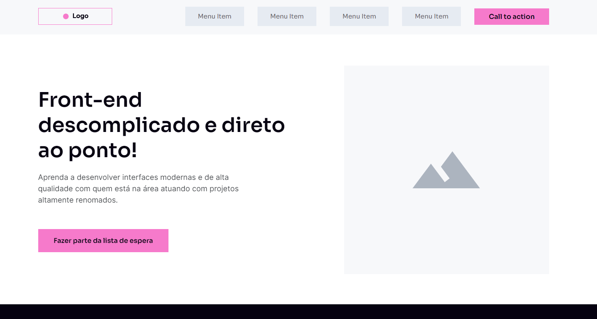

# Wireframe - Projeto.

  

# 🎇 Tecnologias

Esse projeto foi desenvolvido com as seguintes tecnologias:

- HTML 5
- CSS 3 (Utilizando o Flexbox)
- Javascript

# 🎆 Sites utilizado para o desenvolvimento

- [AOS](https://michalsnik.github.io/aos/) Animate On Scroll - Javascript
- [MDN - CSS](https://developer.mozilla.org/pt-BR/docs/Web/CSS) - O MDN Web Docs é o website oficial de Mozilla para desenvolvimento de padrões web.

# 🎯 Acesse ao projeto

Você pode acessar o site pelo link abaixo:

- [Wireframe](https://wireframe-lucas.netlify.app/) - O site está hospedado gratuitamente na Netlify

# 💼 Direitos

- Todos os direitos reservados por Will Moreira - [Codeboost](https://codeboost.com.br/)  
- Feito por Lucas Cano.
